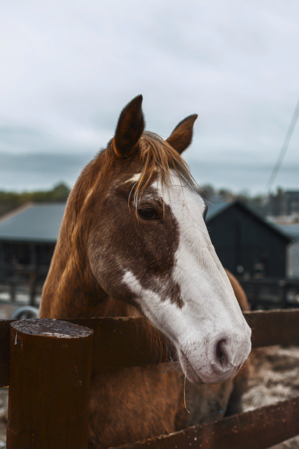

# ColorizeNet

This model is a ControlNet based on SD-v2.1, trained for image colorization from black and white images.

## Model Details

### Model Description

ColorizeNet is an image colorization model based on ControlNet, trained using the pre-trained Stable Diffusion model version 2.1 proposed by Stability AI.

- **Finetuned from model :** [https://huggingface.co/stabilityai/stable-diffusion-2-1]

## Usage

### Training Data

<!-- This should link to a Data Card, perhaps with a short stub of information on what the training data is all about as well as documentation related to data pre-processing or additional filtering. -->

The model has been trained on COCO, using all the images in the dataset and converting them to grayscale to use them to condition the ControlNet

[https://huggingface.co/datasets/detection-datasets/coco]

### Run the model with Gradio

Run the `gradio_colorization.py` and load your image via the interface

## Results

<table>
  <thead>
    <tr>
      <th style="text-align:center"> BW Input </th>
      <th style="text-align:center"> Colorized </th>
    </tr>
  </thead>
  <tbody>
    <tr>
      <td style="width: 50%;"> </td>
      <td style="width: 50%;"></td>
   </tr> 
    <tr>
      <td style="width: 50%;"> </td>
      <td style="width: 50%;"></td>
   </tr> 
    <tr>
      <td style="width: 50%;"> </td>
      <td style="width: 50%;"></td>
   </tr> 
    <tr>
      <td style="width: 50%;"> </td>
      <td style="width: 50%;"></td>
   </tr> 
    <tr>
      <td style="width: 50%;"> </td>
      <td style="width: 50%;"></td>
   </tr> 
    <tr>
      <td style="width: 50%;"> </td>
      <td style="width: 50%;"></td>
   </tr> 
  </tbody>
  </td>
  </tr>
</table>

## Additional Resources
For more information on ControlNet, please refer to the [original repository](https://github.com/lllyasviel/ControlNet)
